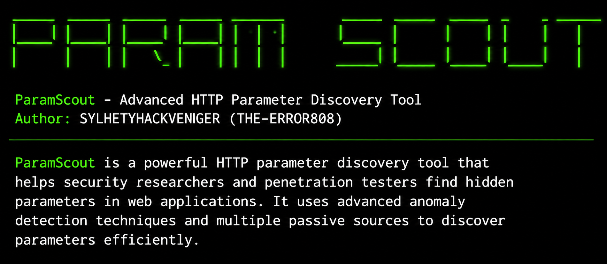
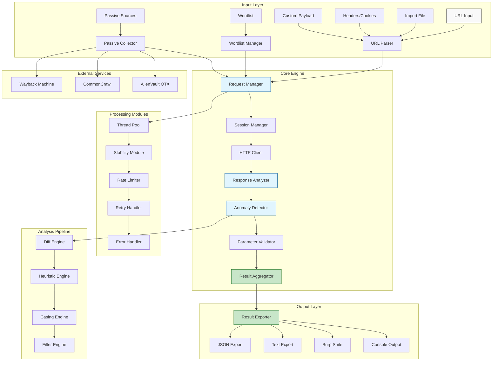
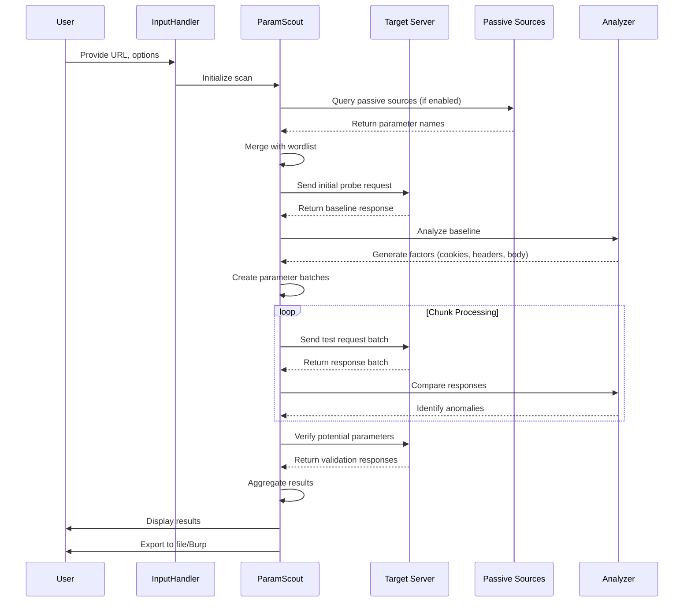
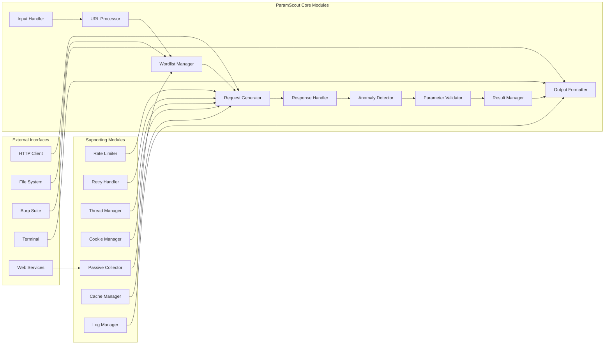
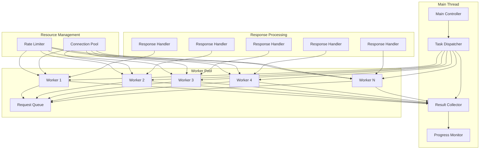

# ParamScout - Advanced HTTP Parameter Discovery Tool
<p align="center">
  
</p>

<div align="center">


**Advanced HTTP Parameter Discovery Tool for Security Researchers & Penetration Testers**

Installation • Quick Start • Features • Architecture • Documentation

</div>

---

📖 Description

ParamScout is a state-of-the-art, production-grade HTTP parameter discovery framework engineered specifically for security researchers, penetration testers, and bug bounty hunters seeking to uncover hidden, undocumented, and potentially vulnerable parameters within web applications. Unlike traditional parameter brute-forcing tools that rely solely on static wordlists and simple response codes, ParamScout employs a sophisticated multi-layered approach combining intelligent anomaly detection, heuristic analysis, passive intelligence gathering from archival sources, and adaptive rate limiting to achieve exceptional discovery rates while maintaining operational stealth.

The tool's core innovation lies in its anomaly-based detection engine, which establishes a baseline of normal application behavior and then systematically analyzes response variations—including HTTP status codes, header structures, content length, response body differences, reflection patterns, and redirection behavior—to identify parameters that trigger meaningful changes in application responses. This approach enables ParamScout to discover parameters that traditional tools miss, including those that don't produce obvious error messages or status code changes.

ParamScout also features a powerful passive intelligence component that aggregates parameter names from multiple external sources including the Wayback Machine, CommonCrawl's web archive, and AlienVault's OTX threat intelligence platform. This passive collection enriches the active brute-force process with real-world parameter names observed in historical and current web traffic, significantly expanding the discovery surface. The tool supports multiple request methods (GET, POST, JSON, XML), custom header injection, cookie management, and sophisticated retry logic with exponential backoff for stability in challenging network environments. With its comprehensive output options including JSON export, text formatting, and direct Burp Suite integration, ParamScout provides security professionals with a complete parameter discovery solution capable of handling everything from simple web applications to complex API endpoints and microservices architectures.

---

🚀 Key Features

Core Capabilities

Feature Description
Multi-Method Support GET, POST, JSON, XML request methods with automatic payload formatting
Intelligent Wordlists Built-in wordlists (large, medium, small) with custom wordlist support
Passive Parameter Discovery Extracts parameters from Wayback Machine, CommonCrawl, and AlienVault OTX
Heuristic Analysis Identifies parameters from JavaScript, HTML forms, and response bodies
Anomaly-Based Detection Compares 10+ response metrics to identify valid parameters
Thread Pooling Concurrent scanning with configurable thread count for optimal performance
Rate Limiting Built-in protection with configurable requests per second to avoid detection
Retry Logic Automatic retry with intelligent exponential backoff for network stability
Response Analysis Deep HTTP response parsing with content-type awareness and size limits
Case Transformation Automatic parameter case conversion (camelCase, snake_case, PascalCase)

Advanced Features

· Burp Suite Integration: Direct parameter injection through Burp Suite proxy
· JSON Export: Structured output with complete request/response metadata
· Text Export: Clean parameter lists in query string or tab-separated format
· Header Customization: Support for custom HTTP headers with interactive prompt
· Passive Data Aggregation: Combine data from 3+ external sources
· Chunk-Based Processing: Intelligent wordlist chunking for large-scale scanning
· Stability Mode: Prefer reliability over speed with extended timeouts and delays
· Redirect Handling: Configurable follow/disable redirects option
· SSL Verification: Optional SSL verification toggle for testing environments
· Response Size Limiting: Configurable max response size to prevent memory issues

---

📦 Installation

Prerequisites

```bash
# System Requirements
- Python 3.6 or higher
- pip (Python package manager)
- 50MB+ free disk space
- Network connectivity for passive data sources
- Linux/MacOS/Windows with terminal support
```

Installing ParamScout

Method 1: Direct Download (Recommended)

```bash
# Clone the repository
git clone https://github.com/sylhetyhackvenger/ParamScout 
cd ParamScout 

# Install dependencies
pip install -r requirements.txt

# Make executable (Unix/Linux/Mac)
chmod +x paramscout.py

# Verify installation
python3 paramscout.py -h
```

Method 2: Using Setup Script

```bash
# Download and run setup script
curl -o install.sh https://raw.githubusercontent.com/sylhetyhackvenger/ParamScout/main/install.sh
chmod +x install.sh
./install.sh
```

Method 3: Docker Installation

```bash
# Build Docker image
docker build -t paramscout .

# Run container
docker run -it paramscout -u https://example.com

# Mount local files
docker run -it -v $(pwd):/data paramscout -u https://example.com -o /data/results.json
```

Method 4: Manual Installation

```bash
# Download the script
wget https://raw.githubusercontent.com/sylhetyhackvenger/ParamScout/main/paramscout.py

# Create required directories
mkdir -p assets/db

# Download wordlists
wget -O assets/db/large.txt https://raw.githubusercontent.com/sylhetyhackvenger/ParamScout/main/assets/db/large.txt
wget -O assets/db/medium.txt https://raw.githubusercontent.com/sylhetyhackvenger/ParamScout/main/assets/db/medium.txt
wget -O assets/db/small.txt https://raw.githubusercontent.com/sylhetyhackvenger/ParamScout/main/assets/db/small.txt
```

---

🚀 Quick Start

Basic Usage

```bash
# Single URL scan with default settings
python3 paramscout.py -u https://example.com

# Scan with custom wordlist
python3 paramscout.py -u https://example.com -w custom_wordlist.txt

# Scan with JSON output
python3 paramscout.py -u https://example.com -o results.json

# Scan with passive parameter collection
python3 paramscout.py -u https://example.com --passive

# Scan with specific method and headers
python3 paramscout.py -u https://example.com/api -m POST --headers "X-API-Key: 12345"
```

Advanced Usage

```bash
# POST method with custom headers and JSON output
python3 paramscout.py -u https://example.com/api -m POST --headers "X-API-Key: 12345" -o results.json

# Bulk scanning from file
python3 paramscout.py -i targets.txt -t 10 -o results.json

# Burp Suite integration
python3 paramscout.py -u https://example.com -oB 127.0.0.1:8080

# Stable mode with rate limiting
python3 paramscout.py -u https://example.com --stable --rate-limit 10

# JSON API with custom payload
python3 paramscout.py -u https://api.example.com/search -m JSON --include '{"query":"$paramscout$","limit":10}'

# XML API with custom payload
python3 paramscout.py -u https://api.example.com/data -m XML --include '<root><param>$paramscout$</param></root>'

# With custom headers from file
python3 paramscout.py -u https://example.com --headers @headers.txt
```

---

💡 Usage Examples

<p align="center">
  
</p>

Example 1: Basic Parameter Discovery

```bash
python3 paramscout.py -u https://example.com/products
```

Output:

```
[+] ParamScout - Advanced HTTP Parameter Discovery Tool
[*] Probing the target for stability
[*] Analysing HTTP response for anomalies
[+] Extracted 15 parameters from response for testing: id, category, sort, order, ...
[+] Parameters found: id, category, sort, order, limit, offset, q
```

Example 2: API Testing

```bash
python3 paramscout.py -u https://api.example.com/v1/users -m JSON --headers "Authorization: Bearer token123" -o api_results.json
```

Example 3: Large-Scale Deployment

```bash
# Use passive sources and output to Burp
python3 paramscout.py -i targets.txt --passive example.com -oB 127.0.0.1:8080 -t 20 --stable --rate-limit 5
```

Example 4: Custom Wordlist Generation

```bash
# Generate custom wordlist with case transformation
python3 paramscout.py -u https://example.com -w mixed.txt --casing camelCase
```

Example 5: JSON API with Custom Payload

```bash
# Include JSON payload with parameter placeholder
python3 paramscout.py -u https://api.example.com/search -m JSON --include '{"query":"$paramscout$","limit":10}'
```

Example 6: XML API Testing

```bash
# Test XML endpoints with custom root element
python3 paramscout.py -u https://api.example.com/xml -m XML --include '<?xml version="1.0"?><request><params>$paramscout$</params></request>'
```

Example 7: Interactive Header Input

```bash
# Interactive header prompt
python3 paramscout.py -u https://example.com --headers
# Then paste headers in the editor that opens
```

---

🏗️ Architectural Simulator

System Architecture Diagram



Data Flow Diagram



Component Architecture



Execution Flow Diagram

```mermaid
flowchart TD
    Start([Start]) --> Init[Initialize Parameters & Config]
    Init --> LoadWordlist[Load Wordlist from File/Default]
    LoadWordlist --> PassiveCollect{Passive Mode?}
    PassiveCollect -->|Yes| GetPassive[Collect Passive Parameters]
    PassiveCollect -->|No| ValidateTarget[Validate Target URL]
    GetPassive --> MergeWordlist[Merge with Wordlist]
    MergeWordlist --> ValidateTarget
    
    ValidateTarget --> ProbeTarget[Probe Target with Initial Request]
    ProbeTarget --> CheckHealth{Target Healthy?}
    CheckHealth -->|No| ErrorHandler[Handle Error/Timeout]
    CheckHealth -->|Yes| GetBaseline[Get Baseline Response]
    
    GetBaseline --> HeuristicAnalyze[Heuristic Analysis]
    HeuristicAnalyze --> ExtractParams[Extract Parameters from Response]
    ExtractParams --> BuildFactors[Build Response Factors]
    
    BuildFactors --> CreateBatches[Create Parameter Batches]
    CreateBatches --> ProcessBatches[Process Each Batch]
    
    ProcessBatches --> SendRequests[Send Test Requests]
    SendRequests --> CompareResponses[Compare with Baseline]
    CompareResponses --> DetectAnomalies{Anomalies Detected?}
    
    DetectAnomalies -->|Yes| IsolateParams[Isolate Potential Parameters]
    DetectAnomalies -->|No| NextBatch{More Batches?}
    
    IsolateParams --> VerifyParams[Verify with Targeted Requests]
    VerifyParams --> ValidateResults[Validate and Filter Results]
    ValidateResults --> StoreResults[Store Valid Parameters]
    
    NextBatch -->|Yes| ProcessBatches
    NextBatch -->|No| AggregateResults[Aggregate All Results]
    
    StoreResults --> AggregateResults
    AggregateResults --> ExportResults[Export Results]
    ExportResults --> DisplayOutput[Display to User]
    DisplayOutput --> End([End])
    
    ErrorHandler --> End
    
    style Start fill:#4CAF50,stroke:#388E3C,color:white
    style End fill:#4CAF50,stroke:#388E3C,color:white
    style DetectAnomalies fill:#FFC107,stroke:#FFA000
    style ValidateTarget fill:#2196F3,stroke:#1976D2,color:white
    style ExportResults fill:#9C27B0,stroke:#7B1FA2,color:white
```



Thread Management Architecture



```

---

🎯 Advanced Features

1. Passive Parameter Collection

ParamScout integrates with multiple external sources to collect parameter names:

```bash
# Collect from all sources
python3 paramscout.py -u https://example.com --passive

# Collect from specific domain
python3 paramscout.py -u https://api.example.com --passive example.com

# Disable passive collection (default)
python3 paramscout.py -u https://example.com
```

Sources:

· Wayback Machine: Historical web archives
· CommonCrawl: Web crawl data
· AlienVault OTX: Threat intelligence platform

2. Anomaly Detection Engine

The anomaly detector analyzes multiple response metrics:

Metric Description
HTTP Status Code Differences in response codes
Response Headers Header structure and values
Content Length Size differences
Line Count Number of response lines
Body Content Text differences
HTML Structure DOM structure variations
Plaintext Extraction Text-only comparison
Redirect Location Path differences
Parameter Reflection Parameter name/value in response
Error Messages Presence of error indicators

3. Intelligent Wordlist Management

```bash
# Use built-in wordlists
python3 paramscout.py -u "https://example.com" -w large    # 10,000+ parameters
python3 paramscout.py -u "https://example.com" -w medium   # 5,000+ parameters
python3 paramscout.py -u "https://example.com" -w small    # 1,000+ parameters

# Custom wordlist
python3 paramscout.py -u "https://example.com" -w /path/to/wordlist.txt

# Case transformation
python3 paramscout.py -u "https://example.com" --casing camelCase
python3 paramscout.py -u "https://example.com" --casing snake_case
python3 paramscout.py -u "https://example.com" --casing PascalCase
```

4. Rate Limiting & Stability

```bash
# Stable mode for challenging targets
python3 paramscout.py -u "https://example.com" --stable

# Configure rate limit
python3 paramscout.py -u "https://example.com" --rate-limit 10

# Combined stable + rate limit
python3 paramscout.py -u "https://example.com" --stable --rate-limit 5
```

5. Response Analysis

```bash
# Set maximum response size (20MB default)
python3 paramscout.py -u https://example.com --max-response-size 50000000

# Disable redirects
python3 paramscout.py -u https://example.com --disable-redirects

# Custom timeout
python3 paramscout.py -u https://example.com -T 30
```

---

⚙️ Configuration Options

Complete Command Reference

Option Description Default
-u URL Target URL None
-o FILE JSON output file None
-oT FILE Text output file None
-oB [PROXY] Burp Suite proxy output None
-d SECONDS Delay between requests 0
-t THREADS Number of concurrent threads 5
-w WORDLIST Wordlist file path large
-m METHOD Request method (GET/POST/XML/JSON) GET
-i [FILE] Import targets from file None
-T SECONDS HTTP request timeout 15
-c CHUNKS Parameter chunk size 250
-q Quiet mode False
--rate-limit N Max requests per second 9999
--headers [HEADERS] Custom HTTP headers None
--passive [DOMAIN] Enable passive collection None
--stable Stability over speed False
--include DATA Include data in requests None
--disable-redirects Disable following redirects False
--casing STYLE Parameter case style None
--retries N Max retry attempts 3
--verify-ssl Verify SSL certificates False
--max-response-size N Max response size in bytes 20,000,000

Environment Variables

```bash
# Set default headers
export PARAMSCOUT_HEADERS="Authorization: Bearer token123"

# Set default wordlist path
export PARAMSCOUT_WORDLIST="/path/to/wordlist.txt"

# Set proxy settings
export HTTP_PROXY="http://proxy.example.com:8080"
export HTTPS_PROXY="https://proxy.example.com:8080"
```

---

📊 Output Formats

JSON Output

```json
{
  "https://example.com/api/v1/users": {
    "params": [
      "id",
      "name",
      "email",
      "role",
      "limit",
      "offset",
      "sort",
      "order"
    ],
    "method": "GET",
    "headers": {
      "User-Agent": "Mozilla/5.0...",
      "Accept": "application/json",
      "Authorization": "Bearer token123"
    }
  }
}
```

Text Output

```
# GET parameters
https://example.com/products?id=1&category=2&sort=desc&order=id&limit=10

# POST parameters
https://example.com/api/search	id=1&category=2&sort=desc&order=id&limit=10

# JSON parameters
https://example.com/api/v1/users	{"id":"1","name":"2","email":"3","role":"4"}
```

Console Output

```
[+] ParamScout - Advanced HTTP Parameter Discovery Tool
[*] Probing the target for stability
[*] Analysing HTTP response for anomalies
[+] Extracted 15 parameters from response for testing
[*] Processing chunks: 45/50
[+] Parameter detected: id, based on: body length
[+] Parameter detected: category, based on: http code
[+] Parameter detected: sort, based on: text length
[+] Parameters found: id, category, sort, order, limit, offset, q

[✓] Results exported to: results.json
[✓] Results exported to: results.txt
```

---

🔗 Integration

Burp Suite Integration

```bash
# Send discovered parameters to Burp
python3 paramscout.py -u "https://example.com" -oB

# Custom Burp proxy
python3 paramscout.py -u "https://example.com" -oB 127.0.0.1:8081

# With passive collection
python3 paramscout.py -u "https://example.com" --passive -oB
```

Custom Script Integration

```python
# Example: Python script integration
import subprocess
import json

result = subprocess.run(
    ['python3', 'paramscout.py', '-u', 'https://example.com', '-o', 'results.json'],
    capture_output=True,
    text=True
)

with open('results.json', 'r') as f:
    data = json.load(f)
    for url, info in data.items():
        print(f"URL: {url}")
        print(f"Parameters: {', '.join(info['params'])}")
```

CI/CD Pipeline Integration

```yaml
# GitHub Actions example
name: Parameter Discovery
on: [push, pull_request]

jobs:
  scan:
    runs-on: ubuntu-latest
    steps:
      - uses: actions/checkout@v2
      - name: Install dependencies
        run: pip install -r requirements.txt
      - name: Run ParamScout
        run: python3 paramscout.py -u "https://staging.example.com" -o results.json
      - name: Upload results
        uses: actions/upload-artifact@v2
        with:
          name: paramscout-results
          path: results.json
```

---

🛠️ Troubleshooting

Common Issues and Solutions

Issue Solution
Connection Timeout Increase timeout: -T 30 or use --stable
Rate Limiting Enable stable mode: --stable --rate-limit 5
Payload Too Large Reduce chunk size: -c 100
URI Too Long Reduce chunk size: -c 50
SSL Certificate Error Use --verify-ssl or disable verification
Module Not Found Install dependencies: pip install -r requirements.txt
Permission Denied Make executable: chmod +x paramscout.py
Wordlist Not Found Check path or use built-in wordlists: -w large

Debug Mode

```bash
# Enable verbose output
python3 paramscout.py -u https://example.com -q

# Debug with Python
python3 -m pdb paramscout.py -u https://example.com

# Log output to file
python3 paramscout.py -u https://example.com 2>&1 | tee scan.log
```

---

🤝 Contributing

We welcome contributions! Please follow these steps:

1. Fork the repository on GitHub
2. Create a feature branch: git checkout -b feature/amazing-feature
3. Commit your changes: git commit -m 'Add amazing feature'
4. Push to branch: git push origin feature/amazing-feature
5. Open a Pull Request

Development Setup

```bash
# Clone the repository
git clone https://github.com/sylhetyhackvenger/ParamScout 
cd ParamScout 

# Install development dependencies
pip install -r requirements-dev.txt

# Run tests
pytest tests/

# Check code style
flake8 paramscout.py
```

---

📝 License

This project is licensed under the MIT License - see the LICENSE file for details.

---

👨‍💻 Author

SYLHETYHACKVENGER (THE-ERROR808)

· GitHub: @sylhetyhackvenger

---

🙏 Acknowledgments

· Security community for continuous inspiration
· Contributors and testers for valuable feedback
· Open-source projects that made ParamScout possible:
  · Python Requests library
  · Concurrent.futures
  · All passive data providers

---

📚 Documentation

· Full Documentation
· API Reference
· Troubleshooting Guide
· Contributing Guidelines

---

<div align="center">

Made with ❤️ by SYLHETYHACKVENGER (THE-ERROR808)

⬆ Back to Top

</div>
